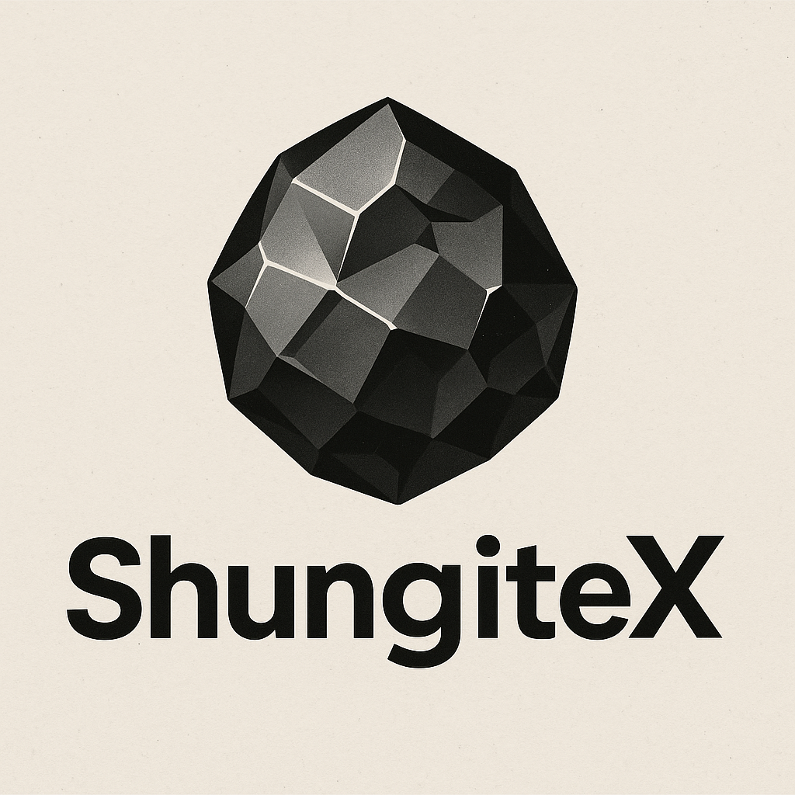
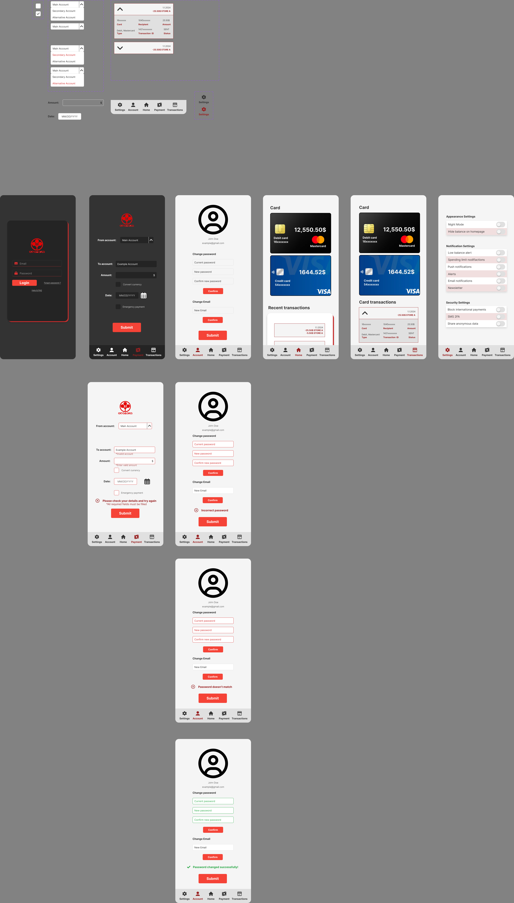
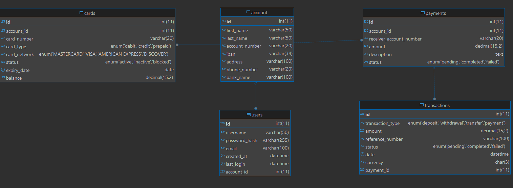

# ShungiteX-Banking-App
  Deadline for submission: **1st of June 2025** 23:59

  

---

ShungiteX is a mobile banking app for managing your account balance, managing multiple credit cards and making online payments. This app acts as showcase of everything we learned from course Introduction to Mobile Programming using Kotlin. Key features involve Transcation tracking, two cards per account (credit and debit) and options for better user experience.

### Banking App Skeleton

The app is following skeleton as shown
### ER Diagram

